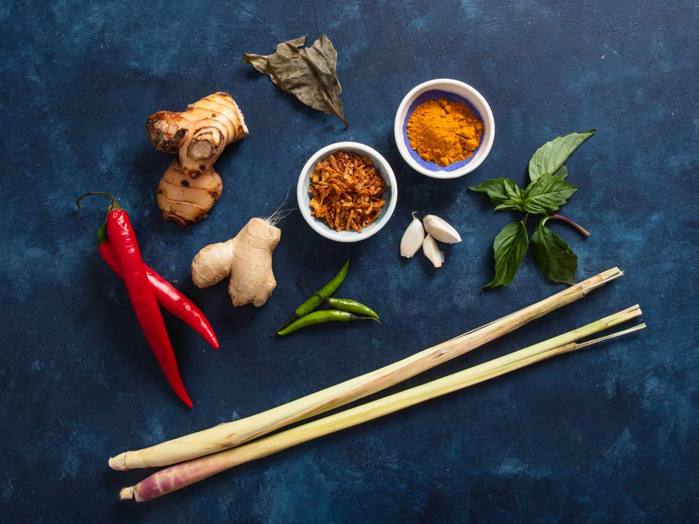
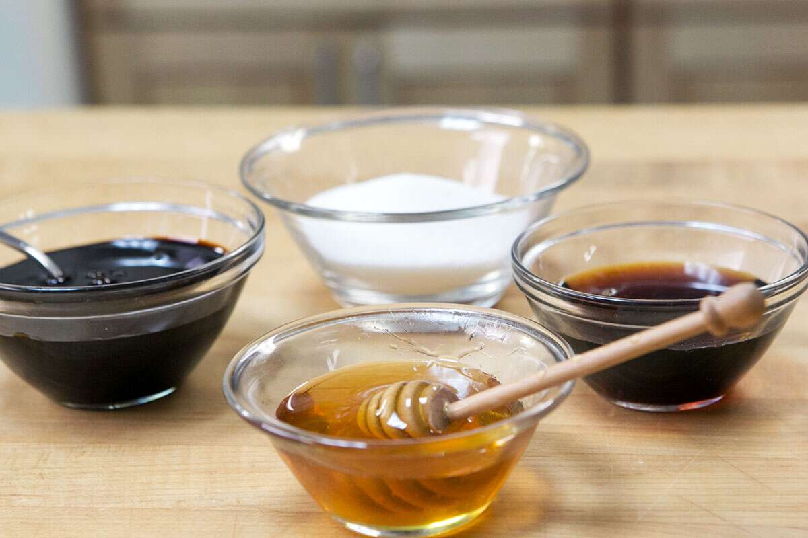
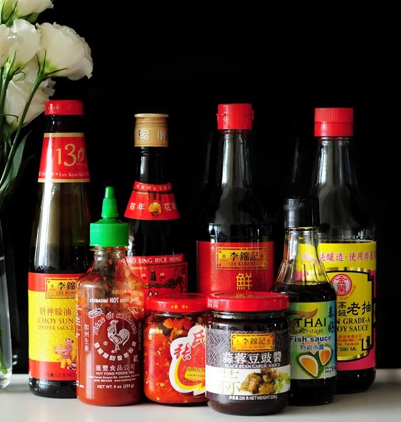

tt: Ingredient Functions
nx: whole-vs-processed.html
---

You might have made something with a recipe before, but did you ever wonder why the food tasted like it tasted, what role does each ingredient play? This article will teach you the basics of ingredient functions, so you can learn from recipes and perhaps create your own, with enough practice.

## Introduction
There are many ingredients that have special functions in the baking and cooking process. Some functions are critical to the success of the finished product. Some of these ingredients can be substituted with other ingredients and produce the same outcome but many times substitutions will have some affect on the end product.

Here are a list of the functions of many popular ingredients you may come across when scouring recipes:

### Dry Ingredients

Herbs
: Herbs are fragrant plants used to season foods, and add a bit of extra flavour. Try to get a sense of the herbs used in recipes, perhaps try to predict the herbs used before looking at the ingredients!

Garlic
: Garlic as a seasoning is used as a flavouring agent (substances that give something additional flavour), and starts out pungent and slightly bitter, but becomes mild and sweet when cooked.

Ginger
: Ginger is a popular flavouring ingredient in asian dishes, where it originated and fresh ginger packs tons of warm, pungent, peppery flavor that works well with meats and vegetables.

Spices
: Spices have strong flavours and aromas that are used to add flavour to foods. Most spices are available in both whole and ground form, but ground spices lose their flavour quicker.

Salt & Pepper
: Salt is a seasoning that sharpens the flavour of other ingredients, and enhances the sweetness of the food. Notice that if a recipe has little salt, the flavour of the other ingredients usually compensate, and vice versa.
: Pepper is a savoury spice, and is used to change the  flavour of your dish, adding depth and some spice. The main difference between salt and pepper is that while salt and acid enhance, pepper adds flavor to the overall dish.

Eggs
: Eggs can be eaten on their own but they also serve a big role as a cooking ingredient. They give cooked dishes structure and texture, while also adding flavour, colour, liquid, protein and fat. The yolks add tenderness and flavour, while the egg whites add volume.

### Liquids

Extracts
: Extracts are made from extracting the oil from certain foods, and are useful for adding concentrated flavouring to dishes.

Cream
: Whipped cream (aka Heavy cream, double cream) provides a rich, creamy texture to the foods it is added to. In cooking, it is mostly used to add the creamy texture to sauces and soups.
: Light cream is used in making soups, sauces, desserts and baked goods. When used in place of heavy cream, the foods texture will not be as creamy, and will separate or curdle easier than heavy cream
: Sour cream has a thick consistency and slightly tangy. It is slightly acidic, all of which make it a good topping or dipping.

Honey
: Honey is used as a sweetener and has a distinctive flavor that is influenced by the type of flowers and plants that the nectar is taken from.

Vinegar
: Vinegar adds a sour, pungent taste to the foods it is added to. It has a tendency to lose its pungency when heated so if you desire a stronger flavor from the vinegar when adding it to a heated dish, you should add it after the dish is removed from the heat.

Soy sauce
: Soy sauce provides salt, sweet, umami (savory), and even a little bitter flavor. This balanced flavor profile makes it an excellent condiment. Soy sauce can be used in a marinade or braising liquid for meat or added when cooking stews or soups. It's a basic way of building depth of flavor, is not affected by heat during cooking, and can provide a pleasing brown color to your dish. In stir-fries, it is usually mixed with the vegetables before including the noodles, but more soy sauce can be added at any time in the cooking process.

Butter
: Butter creates flaky pastries, and it provides flavor, tenderness, crispness, and a golden-brown color to many foods. The unsalted variety is often used when cooking because it allows the cook to have more control over the seasoning. It is used when frying and sautéing food, as a spread for baked goods such as breads and rolls, and as a flavoring for cooked vegetables.

Oil
: Oil helps food cook evenly, adds flavour, stops it sticking and brings an attractive sheen to the dish. Olive oil is made by crushing olives into a paste, and results in a grassy oil with a peppery flavour. Vegetable oil is neutral in flavour and pale in colour, used when there shouldn't be much flavour. Rice bran oil is extracted from the outer bran or husk of rice grains. Because of its high smoke point, it is useful for high-heat cooking and is often used in various cuisines of South and East Asian countries.
: Sesame oil has a concentrated flavor and should be used in small amounts. It is known for its nutty, toasty flavour and aroma, used in dressings and sauces.

Cooking wine
: Wine has three main uses in the kitchen – as a marinade ingredient, as a cooking liquid, and as a flavoring in a finished dish. The function of wine in cooking is to intensify, enhance, and accent the flavor and aroma of food – not to mask the flavor of what you are cooking but rather to fortify it.

## Citations
1. RecipeTips, Ingredient Functions, recipetips (2022). Viewed Sun 24 Jul 2022
2. MasterClass staff, Cooking With Black Pepper: Understanding How Black Pepper Modifies the Flavor of Food, masterclass (Sep 9, 2021). Viewed Sun 24 Jul 2022
3. Bethany Moncel, What Is Soy Sauce, thespruceeats (10/13/21). Viewed Sun 24 Jul 2022
4. Everything you need to know about cooking with oil, lovefood (30 January
2019). Viewed Sun 24 Jul 2022
5. MasterClass staff, Learn How to Cook With Sesame Oil, masterclass (Aug 4, 2021). Viewed Sun 24 Jul 2022
6. RecipeTips, All about Garlic, recipetips (2022). Viewed Thu 30 Aug 2022
7. RecipeTips, All about Ginger, recipetips (2022). Viewed Thu 30 Aug 2022
8. J.M. Hirsch, How to use fresh ginger, foodnetwork (2011). Viewed Thu 30 Aug 2022

## Images
1. [ingredients](https://www.seriouseats.com/indonesian-essential-ingredients)
2. [liquids](https://www.kingarthurbaking.com/blog/2017/08/18/baking-with-liquid-sweeteners)
